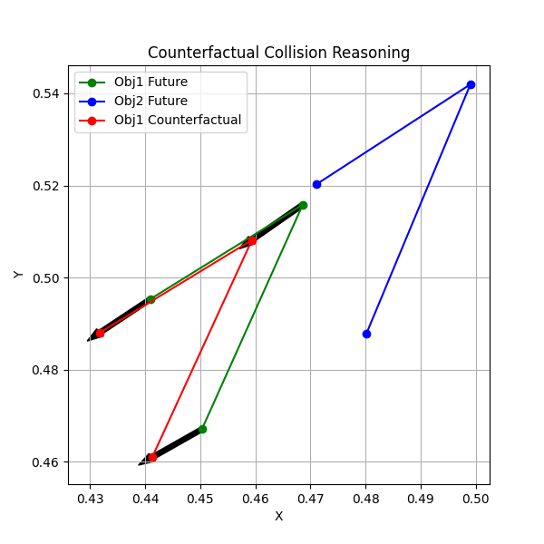

# 🚗 Counterfactual Scene Reasoning for Trajectory Prediction

A system that models object motion from real-world driving data, simulates counterfactual scenarios, and evaluates collision risk using **transformer-based trajectory prediction**, **scene graphs**, and **time-to-collision (TTC) reasoning**.

---

## 🔥 Overview

This project goes beyond standard trajectory prediction by introducing **causal reasoning over motion dynamics**.

Instead of just predicting where objects will go, the system answers:

> *“What happens if an object behaves differently?”*

It does this by:
- Learning motion patterns from data (Transformer)
- Simulating alternative futures (Counterfactuals)
- Modeling interactions between agents (Scene Graph)
- Quantifying risk using physics-based metrics (TTC)

---

## 🧠 Key Features

- ✅ Transformer-based trajectory prediction  
- ✅ Counterfactual simulation (behavior intervention)  
- ✅ Scene graph representation of interactions  
- ✅ Motion-aware reasoning (direction + velocity)  
- ✅ Time-to-Collision (TTC) risk modeling  
- ✅ Human-readable explanations  

---

## 🏗️ System Pipeline
Input Trajectories (KITTI)
↓
Transformer Model
↓
Future Prediction
↓
Counterfactual Simulation
↓
Scene Graph Construction
↓
TTC-based Risk Evaluation
↓
Explanation Generation

---

## 📊 Example Output

### 🖼️ Visualization


---

### 📈 Metrics

--- Metrics ---
Original Distance: 0.0133
Counterfactual Distance: 0.0197
Motion Score (Original): 0.006651
Motion Score (Counterfactual): -0.007745

---

### 🧩 Scene Graph

--- Scene Graph (Original) ---
{'object_A': 'Car_A', 'object_B': 'Car_B', 'relation': 'moving_away', 'distance': 0.019852565601468086, 'motion': 0.0066507430747151375, 'risk': 'LOW'}

--- Scene Graph (Counterfactual) ---
{'object_A': 'Car_A', 'object_B': 'Car_B', 'relation': 'approaching', 'distance': 0.019712993875145912, 'motion': -0.007745200302451849, 'risk': 'HIGH'}

---

### ⚠️ Risk Analysis

--- Risk Analysis ---
Original: LOW (monitor)
Counterfactual: HIGH (collision soon)

---

### 🧾 Explanation

--- Explanation ---
Car_A is moving away from Car_B (distance=0.0199). Risk: LOW.
Car_A is approaching Car_B (distance=0.0197, TTC=2.54s). Risk: HIGH.
```

---

## 🧠 Interpretation

The counterfactual intervention changed interaction dynamics from:

Interpretation: the counterfactual intervention changed interaction dynamics from moving away to approaching, which flipped risk from LOW to HIGH.


## Repository Structure

```text
Casual-Trajectory-Analysis/
|-- collision_test.py            # End-to-end collision reasoning demo
|-- train.py                     # Model training script
|-- model.py                     # Transformer model definition
|-- dataset.py                   # Sequence creation + normalization
|-- main_test.py                 # Alternate test script (legacy)
|-- counterfactual/
|   `-- simulate.py              # Counterfactual speed intervention
|-- scene_graph/
|   `-- graph.py                 # Relation + risk graph construction
|-- utils/
|   |-- kitti_parser.py          # KITTI label parsing
|   |-- trajectory_builder.py    # Trajectory extraction/cleanup
|   `-- kitti_loader.py          # KITTI image sequence loader
|-- data/
|   |-- training/
|   |   |-- image_02/
|   |   `-- label_02/
|   `-- testing/
`-- model.pth                    # Trained weights
```

👉 This demonstrates that **small behavioral changes can significantly alter collision risk**, highlighting the importance of causal reasoning in dynamic environments.

---

## ⚙️ Tech Stack

- PyTorch (Transformer models)
- NumPy (simulation & physics)
- OpenCV (data handling)
- Matplotlib (visualization)
- KITTI Dataset (real-world driving data)

---

## 🚀 Why This Project Stands Out

Most trajectory prediction projects:
- Only predict future positions

This project:
- Models **interactions**
- Simulates **alternate futures**
- Uses **physics-based reasoning**
- Produces **interpretable outputs**

👉 This makes it closer to real-world systems used in:
- Autonomous driving
- Robotics
- Decision intelligence systems

---

## 🔮 Future Work

- Multi-agent transformer (learn interactions directly)
- Attention visualization (interpretability)
- Real-time simulation UI (Streamlit)
- Multi-object scene graphs (3+ agents)

---


## Installation

### 1) Clone

```bash
git clone https://github.com/divyanshg03/Casual-Trajectory-Analysis
cd Casual-Trajectory-Analysis
```

### 2) Create environment and install dependencies

```bash
python -m venv .venv
.venv\Scripts\activate
python -m pip install --upgrade pip
pip install torch numpy matplotlib opencv-python
```

## Dataset Setup

The code expects KITTI tracking style folders under `data/`.

Minimum required for training/inference scripts:

```text
data/
`-- training/
	|-- image_02/
	`-- label_02/
		`-- 0000.txt
```

## Configuration Note

Before running, update `label_path` in:

- `train.py`
- `collision_test.py`
- `main_test.py`

Use your local dataset path, for example:

```python
label_path = "data/training/label_02/0000.txt"
```

## Usage

### Train model

```bash
python train.py
```

This saves weights to `model.pth`.

### Run collision + counterfactual analysis

```bash
python collision_test.py
```

This prints:

- Distance and relative-motion metrics
- Scene-graph dictionaries for original and counterfactual futures
- Risk class for each scenario
- Natural-language explanation

It also opens a Matplotlib visualization comparing trajectories.


## Core Risk Logic

- Relative motion is computed from projected position and velocity differences.
- If relative motion is negative, agents are approaching.
- TTC is computed when approaching; otherwise TTC is infinite.
- Risk tiers are assigned by TTC threshold bands and short-distance fallback rules.

## Limitations

- Current pipeline is sequence-focused and not yet multi-scene benchmarked.
- Interaction pair selection is heuristic (first intersecting pair).
- Paths are partially hard-coded and should be parameterized for portability.

## 📌 Author

Divyansh Gupta

---
