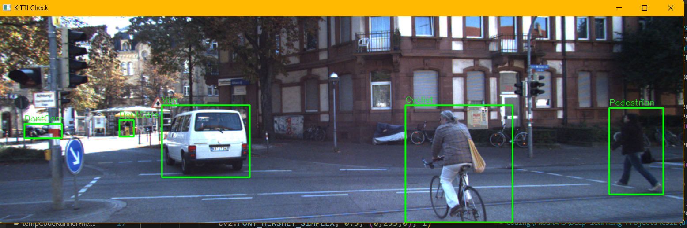

# Counterfactual Scene Reasoning for Trajectory Prediction

A small research prototype that predicts short-term motion of road users from KITTI tracking data with a **Transformer**, applies **counterfactual interventions** ("what if agent A drove twice as fast?"), and compares the resulting **time-to-collision (TTC) risk** of the original and intervened futures.


## What it does

1. Parses KITTI tracking labels and builds per-agent trajectories (box centres).
2. Slides contiguous-frame windows over each track (5 past frames -> 3 future frames).
3. Predicts the future with a Transformer encoder.
4. Picks the **closest pair of agents that are present in the same frames**.
5. Intervenes on agent A's observed past (scale its speed), re-predicts, and rebuilds the pair's scene graph.
6. Reports distance, closing speed, TTC, a risk tier and a text explanation for both worlds.

> **Terminology.** The intervention is a *what-if input perturbation* of the observed motion followed by a model forward pass. It is **not** a structural causal model; see [Limitations](#limitations).

## Quickstart

```bash
git clone https://github.com/divyanshg03/Casual-Trajectory-Analysis
cd Casual-Trajectory-Analysis
python -m venv .venv && source .venv/bin/activate   # Windows: .venv\Scripts\activate
pip install -r requirements.txt

# put KITTI tracking labels under data/ (see Dataset setup), then:
python -m cftraj train   --labels data/training/label_02/0000.txt
python -m cftraj analyze --labels data/training/label_02/0000.txt --factor 2.0
```

Useful flags: `--model PATH`, `--epochs N`, `--seed N`, `--max-distance D` (reject far-apart pairs), `--save-fig out.png`, `--no-show` (headless). Run `python -m cftraj <command> -h` for all options.

### Dataset setup

Download the [KITTI tracking](https://www.cvlibs.net/datasets/kitti/eval_tracking.php) labels and (optionally) left colour images, and arrange them as:

```text
data/
`-- training/
    |-- image_02/0000/...        # only needed for cftraj.data.load_kitti_frames
    `-- label_02/0000.txt
```

### Tests

```bash
pip install -r requirements-dev.txt
ruff check .
pytest
```

CI runs both on every push (`.github/workflows/ci.yml`).

## Example output

`python -m cftraj analyze` on sequence `0000` (frame 127, tracks 10 and 14, speed x2 on A):

```text
--- Risk ---
Original:       SAFE
Counterfactual: HIGH

Car_A is approaching Car_B (distance=0.0244, TTC=12.93s). Risk: SAFE.
Car_A is approaching Car_B (distance=0.0140, TTC=1.26s). Risk: HIGH.
```



(The figure and screenshot are from an earlier version of the script; numbers differ because pair selection now requires co-occurrence.)

## Project layout

```text
cftraj/
  data.py            KITTI parsing, trajectories, windows (with track id + start frame), normalization
  model.py           TrajectoryTransformer, load_model
  train.py           full-batch Adam training
  counterfactual.py  scale_speed intervention
  pairs.py           co-occurring pair selection
  risk.py            closing speed, TTC, risk tiers, scene graph, explanation
  analyze.py         end-to-end analysis, report, plot
  __main__.py        CLI (train / analyze)
tests/               pytest suite
```

## Risk logic

- **Closing speed**: projection of the relative velocity onto the line between the agents (negative = approaching), in normalized image units per frame.
- **TTC** = distance / |closing speed|, divided by the KITTI frame rate (10 Hz) to get seconds; infinite when not approaching.
- **Tiers**: `CRITICAL` < 1 s, `HIGH` < 3 s, `MEDIUM` < 5 s, otherwise `LOW` if the agents are within 0.02 normalized units, else `SAFE`.

## Limitations

Please read these before citing any numbers:

- **Image-plane geometry.** Distances and velocities are in normalized pixels, so perspective distorts them and TTC in "seconds" is only an approximation. Using KITTI 3D labels would give metric TTC.
- **Single-sequence training, no evaluation.** The shipped `model.pth` is trained on sequence `0000` only, with no validation split and no ADE/FDE or baseline comparison (for example constant velocity).
- **Very short horizon.** 3 future frames is about 0.3 s.
- **Not causal inference.** There is no structural causal model, and the intervention's physical plausibility is not validated.
- **Heuristic pair selection and thresholds.** Only the closest co-occurring pair is analysed, and risk thresholds are not calibrated.

## Roadmap

- Train/validate across all KITTI sequences; report ADE/FDE against constant-velocity, Kalman and LSTM baselines.
- Metric (3D bird's-eye-view) coordinates for physically meaningful TTC.
- Multi-agent interaction model (social attention / GNN) and proper graph scene representation.
- Richer interventions (brake, lane change, remove agent) with validity checks.
- Interactive Streamlit demo and animated overlay on KITTI frames.

## Author

Divyansh Gupta - released under the [Apache 2.0 License](LICENSE).
