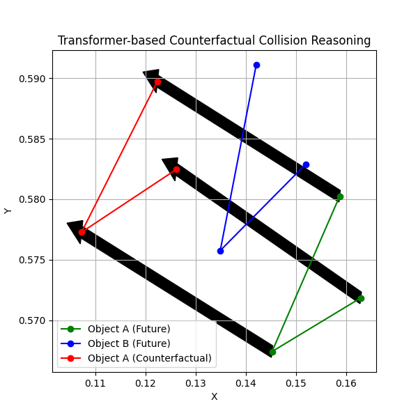

# Casual Trajectory Analysis

Counterfactual trajectory reasoning for collision-risk analysis on KITTI-style tracking data.

This project predicts short-horizon vehicle trajectories, applies a counterfactual intervention (speed increase), and compares risk between the original and modified futures using scene-graph relations, relative motion, and time-to-collision (TTC).

## Overview

The repository implements a full mini-pipeline:

1. Parse KITTI tracking labels.
2. Build and clean per-object trajectories.
3. Create training windows (past 5 steps -> future 3 steps).
4. Train a Transformer-based trajectory predictor.
5. Simulate a counterfactual action with increased speed.
6. Compute relational scene-graph features and collision risk.
7. Visualize original vs counterfactual outcomes.

## Key Features

- Transformer trajectory prediction (`TrajectoryTransformer`)
- Counterfactual simulation (`increase_speed`)
- Scene-graph relation reasoning (`approaching`, `moving_away`, `parallel`)
- Risk scoring from distance + relative motion + TTC
- Human-readable textual explanation of safety state
- Plot-based visual comparison of trajectories

## Example Output

The following values are from an observed run:

```text
--- Metrics ---
Original Distance: 0.0133
Counterfactual Distance: 0.0197
Motion Score (Original): 0.006651
Motion Score (Counterfactual): -0.007745

--- Scene Graph (Original) ---
{'object_A': 'Car_A', 'object_B': 'Car_B', 'relation': 'moving_away', 'distance': 0.019852565601468086, 'motion': 0.0066507430747151375, 'risk': 'LOW'}

--- Scene Graph (Counterfactual) ---
{'object_A': 'Car_A', 'object_B': 'Car_B', 'relation': 'approaching', 'distance': 0.019712993875145912, 'motion': -0.007745200302451849, 'risk': 'HIGH'}

--- Risk Analysis ---
Original: LOW (monitor)
Counterfactual: HIGH (collision soon)

--- Explanation ---
Car_A is moving away from Car_B (distance=0.0199). Risk: LOW.
Car_A is approaching Car_B (distance=0.0197, TTC=2.54s). Risk: HIGH.
```

Interpretation: the counterfactual intervention changed interaction dynamics from moving away to approaching, which flipped risk from LOW to HIGH.

## Visualizations

Here is how the projected trajectories and counterfactual changes look. 




## Repository Structure

```text
Casual-Trajectory-Analysis/
|-- collision_test.py            # End-to-end collision reasoning demo
|-- train.py                     # Model training script
|-- model.py                     # Transformer model definition
|-- dataset.py                   # Sequence creation + normalization
|-- main_test.py                 # Alternate test script (legacy)
|-- counterfactual/
|   `-- simulate.py              # Counterfactual speed intervention
|-- scene_graph/
|   `-- graph.py                 # Relation + risk graph construction
|-- utils/
|   |-- kitti_parser.py          # KITTI label parsing
|   |-- trajectory_builder.py    # Trajectory extraction/cleanup
|   `-- kitti_loader.py          # KITTI image sequence loader
|-- data/
|   |-- training/
|   |   |-- image_02/
|   |   `-- label_02/
|   `-- testing/
`-- model.pth                    # Trained weights
```

## Installation

### 1) Clone

```bash
git clone https://github.com/divyanshg03/Casual-Trajectory-Analysis
cd Casual-Trajectory-Analysis
```

### 2) Create environment and install dependencies

```bash
python -m venv .venv
.venv\Scripts\activate
python -m pip install --upgrade pip
pip install torch numpy matplotlib opencv-python
```

## Dataset Setup

The code expects KITTI tracking style folders under `data/`.

Minimum required for training/inference scripts:

```text
data/
`-- training/
	|-- image_02/
	`-- label_02/
		`-- 0000.txt
```

## Configuration Note

Before running, update `label_path` in:

- `train.py`
- `collision_test.py`
- `main_test.py`

Use your local dataset path, for example:

```python
label_path = "data/training/label_02/0000.txt"
```

## Usage

### Train model

```bash
python train.py
```

This saves weights to `model.pth`.

### Run collision + counterfactual analysis

```bash
python collision_test.py
```

This prints:

- Distance and relative-motion metrics
- Scene-graph dictionaries for original and counterfactual futures
- Risk class for each scenario
- Natural-language explanation

It also opens a Matplotlib visualization comparing trajectories.

## Core Risk Logic

- Relative motion is computed from projected position and velocity differences.
- If relative motion is negative, agents are approaching.
- TTC is computed when approaching; otherwise TTC is infinite.
- Risk tiers are assigned by TTC threshold bands and short-distance fallback rules.

## Limitations

- Current pipeline is sequence-focused and not yet multi-scene benchmarked.
- Interaction pair selection is heuristic (first intersecting pair).
- Paths are partially hard-coded and should be parameterized for portability.

## Future Improvements

- Config file/CLI arguments for data/model paths
- More robust multi-agent interaction selection
- Batch evaluation on multiple KITTI sequences
- Quantitative metrics logging (ADE/FDE and risk confusion matrix)

## License

MIT License (see `LICENSE`).