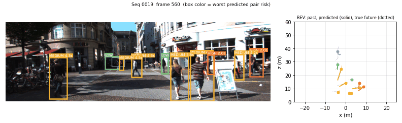
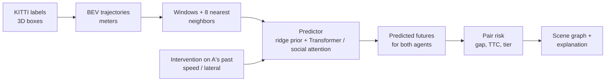
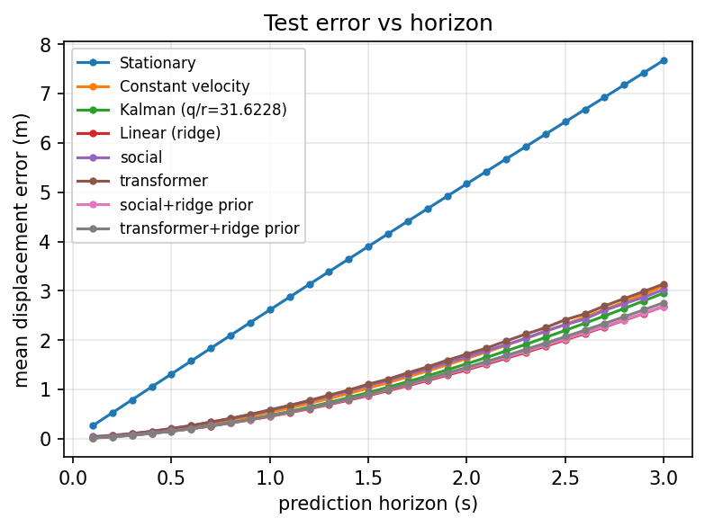
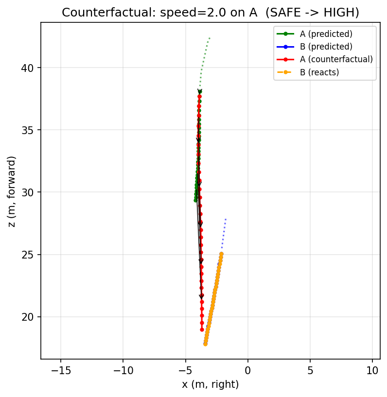
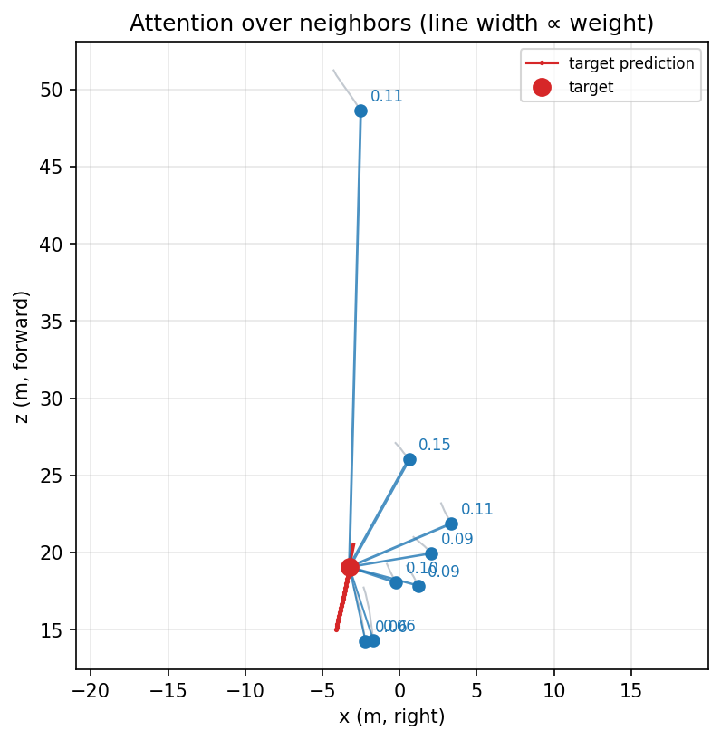

# Counterfactual Scene Reasoning for Trajectory Prediction

[](https://github.com/divyanshg03/Casual-Trajectory-Analysis/actions/workflows/ci.yml)
 

Predict where road users will go on KITTI (in **meters**, bird's-eye view), rewrite one agent's observed motion ("what if A had been moving twice as fast?"), and measure how the predicted **time-to-collision (TTC) risk** of a pair changes. Includes a social-attention model, honest benchmarks against classical baselines, validity checks for the counterfactuals, and an interactive demo.



*Box color = worst predicted pair risk in that frame (camera, left); bird's-eye view with predicted vs. true futures (right).*

## Highlights

- **Honest benchmark.** Models are compared on held-out *sequences* against stationary, constant-velocity, Kalman and ridge-regression baselines (ADE/FDE, 3 seeds, 1 s and 3 s horizons). The headline result is modest: a ridge-regression prior plus a small Transformer correction is the best 1 s model (0.192 m ADE vs 0.194 for ridge), and nothing beats ridge at 3 s. See [Results](#results).
- **Counterfactual engine.** Two interventions (`speed`, `lateral`) rewrite an agent's history while keeping its current position; the social model lets the *other* agent react. `--find-escalation` searches a sequence for the pair whose risk an intervention raises the most.
- **Validity checks, not just accuracy.** Predicted travel must grow monotonically with the speed factor (98.6-100% for the final models), plus a scene-context ablation and precision/recall of conflict detection against real near-misses.
- **Social attention model** with inspectable attention over neighbors. It does **not** beat the non-social models here, and the ablation shows why (see [Findings](#findings)).
- **Interactive Streamlit explorer** and an animated risk overlay on KITTI frames.

## Quickstart

```bash
git clone https://github.com/divyanshg03/Casual-Trajectory-Analysis
cd Casual-Trajectory-Analysis
python -m venv .venv && source .venv/bin/activate   # Windows: .venv\Scripts\activate
pip install -r requirements.txt

# KITTI tracking labels under data/ (see Dataset setup), then use the shipped checkpoints:
python -m cftraj analyze --find-escalation                 # speed x2 on the riskiest-to-change pair
python -m cftraj analyze --find-escalation --intervention lateral --value 3
python -m cftraj attention --labels data/training/label_02/0019.txt
python -m cftraj demo --labels data/training/label_02/0019.txt --first-frame 560 --out docs/demo.gif

pip install -r requirements-app.txt && streamlit run app/streamlit_app.py
```

Train and benchmark your own models:

```bash
python -m cftraj train --arch social      --future-len 30 --ridge-prior --seed 0 --out outputs/social_s0.pt
python -m cftraj train --arch transformer --future-len 10 --ridge-prior --seed 0 --out outputs/tf_s0.pt
python -m cftraj evaluate --ckpt "social+ridge=outputs/social_s0.pt"      # one horizon per call
```

`evaluate` accepts several comma-separated seeds per model (`--ckpt name=a.pt,b.pt,c.pt`) and reports mean ± std; all checkpoints in one call must share the same horizon. Shipped checkpoints: `checkpoints/social_h30.pt` (3 s, social + ridge prior) and `checkpoints/transformer_h10.pt` (1 s, Transformer + ridge prior), both seed 0. Run `python -m cftraj <command> -h` for all options.

### Dataset setup

Download the [KITTI tracking](https://www.cvlibs.net/datasets/kitti/eval_tracking.php) training labels (`label_02`, 21 sequences) and, for the demo GIF, the left colour images:

```text
data/
`-- training/
    |-- image_02/0000/...
    `-- label_02/0000.txt ... 0020.txt
```

**Split (by sequence, no window-level leakage):** test = 0018-0020; validation = 0004, 0011, 0017; train = the other 15. The validation sequences were chosen among the 18 non-test sequences so that their constant-velocity error matches the pooled average (label-derived; test never consulted). The obvious split 0015-0017 is dominated by a nearly static sequence, and early stopping on it stopped after one epoch.

### Tests

```bash
pip install -r requirements-dev.txt
ruff check .
pytest
```

CI runs both on every push. Tests that need the KITTI data and shipped checkpoints (the Streamlit app test) are skipped when those are absent.

## How it works



1. KITTI 3D box locations -> ground-plane `(x, z)` in meters (ego-camera frame); contiguous-frame windows of 10 past frames and 10 or 30 future frames.
2. For each window, the observed pasts of the 8 nearest co-occurring agents (within 30 m) are attached.
3. Models work on positions relative to the last observed point (translation invariant) and predict displacements. The **social** model encodes the target and each neighbor with a shared temporal Transformer, then lets the target attend over its neighbors (with a learned null key so it can ignore them).
4. **Ridge prior (`--ridge-prior`):** a linear path is initialised from the closed-form ridge solution and the network learns only a correction. The ridge-initialised model is a candidate at epoch 0, so selection by validation error can never be worse than ridge on validation.
5. **Risk (`cftraj/risk.py`)** uses the two predicted trajectories: TTC is the time of the first predicted overlap (gap < 2 m); otherwise the closing speed at the end of the horizon is extrapolated; otherwise infinite. Tiers: `CRITICAL` < 1 s, `HIGH` < 3 s, `MEDIUM` < 5 s, else `LOW` if the pair ever comes within 5 m, else `SAFE`. Thresholds are heuristic.

## Results

Test split: KITTI sequences 0018-0020. Errors in meters; learned models are mean ± std over 3 seeds; Kalman `q/r` is tuned on validation and ridge is fit on train. Full tables (conflict detection, validity, ablation) are in [`docs/results_h10.md`](docs/results_h10.md) and [`docs/results_h30.md`](docs/results_h30.md).

| Model | 1 s ADE | 1 s FDE | 3 s ADE | 3 s FDE |
|---|---|---|---|---|
| Stationary | 1.725 | 3.133 | 4.006 | 7.675 |
| Constant velocity | 0.231 | 0.519 | 1.248 | 3.092 |
| Kalman | 0.195 | 0.457 | 1.165 | 2.954 |
| Linear (ridge) | 0.194 | 0.438 | **1.074** | **2.682** |
| Transformer | 0.220 ± 0.003 | 0.489 ± 0.006 | 1.306 ± 0.005 | 3.139 ± 0.013 |
| Social | 0.229 ± 0.002 | 0.505 ± 0.003 | 1.266 ± 0.009 | 3.025 ± 0.035 |
| Transformer + ridge prior | **0.192 ± 0.000** | **0.436 ± 0.001** | 1.106 ± 0.002 | 2.758 ± 0.008 |
| Social + ridge prior | 0.197 ± 0.001 | 0.447 ± 0.004 | 1.085 ± 0.009 | 2.684 ± 0.016 |

(An LSTM variant, `--arch lstm`, performed on par with the plain Transformer in earlier runs: 0.231 / 1.309 m ADE at 1 s / 3 s.)



### Findings

- **Learning barely helps at these horizons.** Plain networks start from constant velocity and have to rediscover the linear shrinkage ridge gets in closed form, so they overfit ~9k highly correlated windows. Anchoring on a ridge prior fixes that, but the learned correction is small (1 s: 0.194 -> 0.192 m; 3 s: no gain on test).
- **Better ADE is not better conflict detection.** Predicting *new* near-misses (pairs 3-15 m apart now whose true gap drops below 3 m later; 559 events at 1 s, 930 at 3 s), constant velocity has the best or near-best F1 for the distance rule (82.0% at 1 s, 71.1% at 3 s). The ADE-optimal ridge-based models are worse (77-79% / 67%), because shrinking predictions toward the mean smooths out approaches. The TTC risk rule is trigger-happy at 1 s (precision ~13%) and conservative at 3 s (precision 41-59%, recall ~30%).
- **Counterfactual responses are physically sensible.** Scaling an agent's past speed by 2x scales its predicted travel by 2.00 ± 0.01x with the ridge prior, travel at 0x is 0-0.2 m, and predictions are monotone in speed for 98.6-100% of agents. The social model without the ridge prior is the exception at 3 s (90.5% monotone, 0.72 m of travel at 0x).
- **The social model does not use its neighbors well.** Masking all neighbors at test time leaves error unchanged or slightly *better* (3 s, social + ridge prior: 1.085 -> 1.065 m), and attention weights are close to uniform (`docs/attention.png`). With ~2 neighbors per agent on average and only 15 training sequences, there is little interaction signal to learn from.



*`analyze --find-escalation` on sequence 0019: speeding up A (green -> red) makes B (orange) react, and the pair's risk goes SAFE -> HIGH (closest approach 11.5 m -> 1.2 m, TTC 2.8 s).*



More: a [lateral-drift intervention](docs/counterfactual_lateral.png) (a pair 8.8 m apart ends 0.25 m apart if A had been drifting sideways) and the [training curves](docs/training_curves_h30.png).

## Project layout

```text
cftraj/
  data.py            KITTI parsing, BEV trajectories (m), windows + neighbors, sequence splits
  model.py           Transformer / LSTM / social-attention models, ridge-initialised linear path
  baselines.py       stationary, constant velocity, Kalman (+ tuning), ridge regression
  metrics.py         ADE / FDE / error by horizon
  train.py           mini-batch AdamW, mirror + optional speed augmentation, best-val checkpointing
  evaluate.py        benchmark tables + plots on the test split
  validity.py        speed-response, context ablation, conflict detection P/R/F1
  counterfactual.py  speed / lateral interventions
  pairs.py           co-occurring pair selection
  risk.py            gap series, TTC, risk tiers, scene graph, explanation
  analyze.py         counterfactual analysis, escalation search, report, plots
  viz.py             attention plot, camera + BEV demo GIF
  __main__.py        CLI: train / evaluate / analyze / demo / attention
app/streamlit_app.py interactive explorer
tests/               pytest suite
checkpoints/         shipped models
docs/                results tables, plots, demo
```

## Limitations

- **Does not beat a linear model at 3 s**, and gains at 1 s are marginal (see Results). Accuracy claims should be read accordingly.
- **Ego-camera frame.** Positions are not compensated for ego-motion (no OXTS data used). Pairwise relative quantities (gap, closing speed, TTC) are unaffected, but the speed intervention scales each agent's *apparent* motion, which includes the camera's own motion; for a parked car seen from a moving ego vehicle, "2x speed" means 2x the ego speed.
- **Not causal inference.** Interventions are what-if rewrites of an agent's observed history followed by a forward pass, with no structural causal model. The validity checks test sanity (monotonicity, scale), not ground truth, since the true counterfactual is unobservable.
- **Heuristic risk and ground truth.** Risk thresholds are uncalibrated, and a "real conflict" is a true center-to-center gap under 3 m, which ignores agent size and orientation.
- **Small data, fixed split, 3 seeds.** The test split is dominated by sequence 0019 (about half of its windows). Selection (early stopping, Kalman tuning, validation split choice) used only non-test sequences; I looked at test error across epochs once while diagnosing overfitting, before fixing the validation split, and did not use it to select anything.

## Roadmap

- Ego-motion compensation (OXTS), per-class (car / pedestrian / cyclist) results.
- Train on more data (e.g. nuScenes / Waymo) where interaction signal may exist, and give the social model an explicit interaction loss.
- Calibrate risk thresholds against a proper conflict definition (agent footprints, headings).

## Author

Divyansh Gupta - released under the [Apache 2.0 License](LICENSE).
